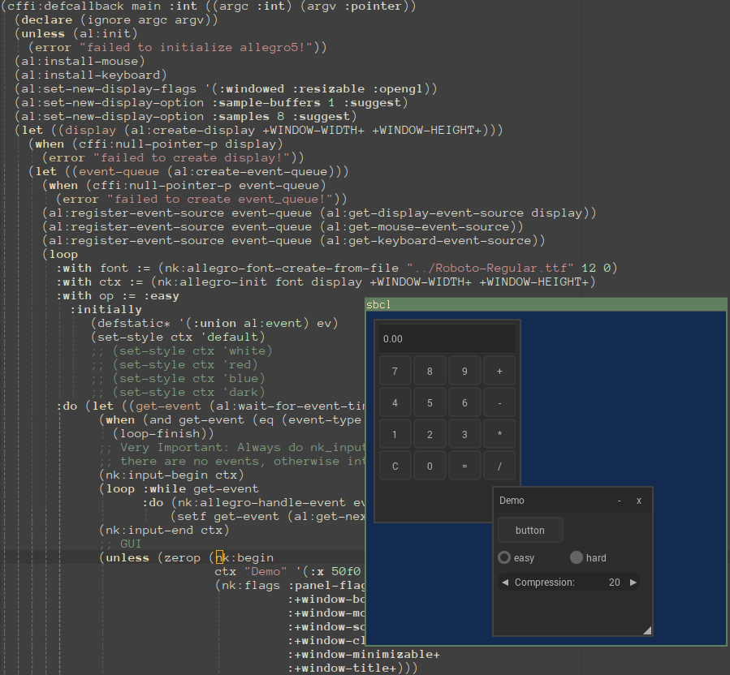

cl-liballegro-nuklear
---------------------
This is [CFFI](https://common-lisp.net/project/cffi) wrapper for the [Nuklear](https://github.com/Immediate-Mode-UI/Nuklear) IM GUI library with [liballegro](https://liballeg.org) backend, to be used with [cl-liballegro](https://github.com/resttime/cl-liballegro).

Nuklear is minimal immediate-mode graphical user interface toolkit. To use it alongside liballegro, you have to write [some amount of glue code](https://github.com/Immediate-Mode-UI/Nuklear/blob/master/demo/allegro5/nuklear_allegro5.h). This library brings both Nuklear itself and that glue code to Common Lisp, so you can just plug it in and have some nice minimal GUI in your [cl-liballegro](https://github.com/resttime/cl-liballegro)-powered application.

Screenshots
-----------


Installation
------------
Just clone this repository to your [Quicklisp's `local-projects`](http://blog.quicklisp.org/2018/01/the-quicklisp-local-projects-mechanism.html) directory and execute `(ql:quickload :cl-liballegro-nuklear)` in your Lisp.

**Note**: upon loading this library with [asdf](https://common-lisp.net/project/asdf), the corresponding foreign library is automatically built (`allegro_nuklear.dll` on Windows, `liballegro_nuklear.so` on more sane operating systems), so you'll have to have [compiler toolchain](https://gcc.gnu.org) and [liballegro dev files](https://liballeg.org/download.html) installed on your machine.

Currently tested to work on following OSes:
* Windows (using [MinGW64](http://mingw-w64.org/doku.php/download/mingw-builds) and `seh-dynamic` variant of [official liballegro binaries](https://github.com/liballeg/allegro5/releases))
* MacOS (using [Homebrew version of liballegro](https://formulae.brew.sh/formula/allegro))
* Linux

...and on following Lisp compilers:
* [SBCL](http://sbcl.org)
* [CCL](https://ccl.clozure.com)
* [ECL](https://common-lisp.net/project/ecl/main.html)
* [ACL](https://franz.com/products/allegro-common-lisp)

Usage
-----

```common-lisp
(ql:quickload '(:cl-liballegro :cl-liballegro-nuklear :float-features))

(cffi:defcallback main :int ((argc :int) (argv :pointer))
  (al:init) (al:init-primitives-addon) (al:init-image-addon)
  (al:init-font-addon) (al:init-ttf-addon)
  (al:install-mouse)
  (let ((display (al:create-display 800 600))
        (event-queue (al:create-event-queue)))
    (al:register-event-source event-queue (al:get-display-event-source display))
    (al:register-event-source event-queue (al:get-mouse-event-source))
    (cffi:with-foreign-object (ev '(:union al:event))
      (loop
        :with font := (nk:allegro-font-create-from-file "Roboto-Regular.ttf" 12 0)
        :with ctx := (nk:allegro-init font display 800 600)
        :do (let ((get-event (al:wait-for-event-timed event-queue ev 0.06)))
              (when (and get-event
                         (eq
                          (cffi:foreign-slot-value ev '(:union al:event) 'al::type)
                          :display-close))
                (loop-finish))
              (nk:input-begin ctx)
              (loop :while get-event
                    :do (nk:allegro-handle-event ev)
                        (setf get-event (al:get-next-event event-queue ev)))
              (nk:input-end ctx)
              (unless (zerop (nk:begin ctx "Demo" '(:x 50f0 :y 50f0 :w 100f0 :h 100f0) 0))
                (nk:layout-row-static ctx 30f0 80 1)
                (unless (zerop (nk:button-label ctx "button"))
                  (format t "button pressed~%"))
                (nk:end ctx)
                (nk:allegro-render)
                (al:flip-display)))
        :finally
           (nk:allegro-font-del font)
           (nk:allegro-shutdown)
           (al:destroy-display display)
           (al:destroy-event-queue event-queue)
           (return 0)))))

(float-features:with-float-traps-masked
    (:divide-by-zero :invalid :inexact :overflow :underflow)
  (al:run-main 0 (cffi:null-pointer) (cffi:callback main)))
```

See [example.lisp](src/example.lisp) for more involved example.

**Note**: `nk:prog` is renamed to `nk:prog-` because of obvious `NAME-CONFLICT` error.

There's also lispy interface making library interaction more idiomatic of CL. See docstrings in [lispy.lisp](src/lispy.lisp) for documentation.

Related projects
----------------
* [bodge-nuklear](http://quickdocs.org/bodge-nuklear), which depends on [nuklear-blob](http://quickdocs.org/nuklear-blob) is other CFFI wrapper for Nuklear. It does not include glue code for liballegro, but designed to work with OpenGL-based [cl-bodge](https://github.com/borodust/cl-bodge) game framework.

Contributing
------------
Merge requests are welcome. For major changes, please [open an issue](https://gitlab.com/lockie/cl-liballegro-nuklear/-/issues/new) first to discuss what you would like to change.

License
-------
[MIT](https://choosealicense.com/licenses/mit)
